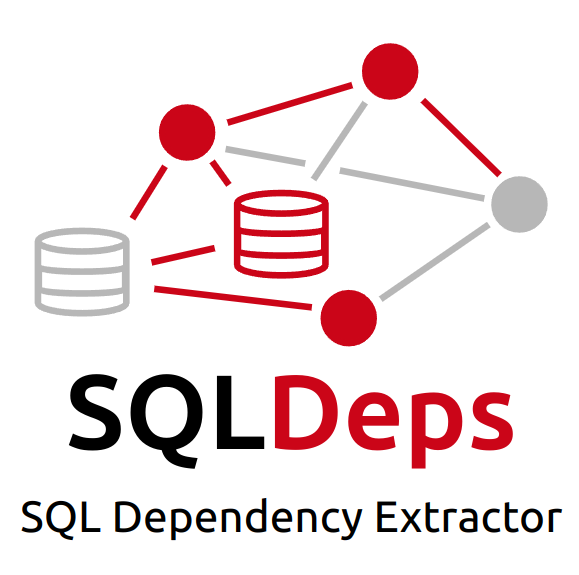

# SQLDeps: SQL Dependency Extractor

<p align="center">
  
</p>

<!-- <p align="center">
  <em>Developed at the <a href="https://gibbs-lab.wisc.edu/" target="blank">Global Land Use and Environment (GLUE)</a> Lab<br>
  <a href="https://nelson.wisc.edu/" target="blank">Nelson Institute for Environmental Studies</a><br>
  University of Wisconsin-Madison</em>
</p> -->

A powerful tool that automatically extracts and maps SQL dependencies and outputs using Large Language Models (LLMs).

## Overview

SQLDeps analyzes SQL scripts to identify:

1. **Dependencies**: Tables and columns that must exist BEFORE query execution
2. **Outputs**: Tables and columns permanently CREATED or MODIFIED by the query

It intelligently filters out temporary constructs like CTEs and derived tables, focusing only on the real database objects that matter.

## Key Benefits

- 🛠️ **Change Management:** Safely modify schemas by identifying true dependencies
- 💾 **Storage Optimization:** Focus resources on essential tables and columns
- 🚢 **Migration Planning:** Precisely determine what needs to be migrated
- 📝 **Project Documentation:** Create comprehensive maps of database dependencies

## Why SQLDeps?

Traditional approaches to SQL dependency tracking:

- **Manual Inspection**: Time-consuming and error-prone
- **Traditional Parsers**: Lacks context and intelligence for complex SQL

SQLDeps leverages the power of Large Language Models to provide intelligent, accurate dependency extraction that works across SQL dialects and complexity levels.

## Supported LLM Providers

All models availables on [LiteLLM](https://docs.litellm.ai/docs/providers) [Groq](https://console.groq.com/docs/models), [OpenAI](https://platform.openai.com/docs/models), and [DeepSeek](https://api-docs.deepseek.com/).

## Getting Started

```bash
# Install the package
pip install sqldeps

# Basic usage
sqldeps extract path/to/query.sql
```

Check out the [Quick Start](getting-started/quick-start.md) guide for more details.

<!-- ## Try the Web App

SQLDeps includes a Streamlit-based web interface for interactive dependency extraction:

```bash
# Run the web app
sqldeps app
```

## Simulate SQLDeps Savings

Interested in evaluating how SQLDeps could benefit your team? Check out our [Time & Cost Simulator](https://sqldeps-simulator.streamlit.app/) to visualize time savings, cost benefits, and return on investment. -->